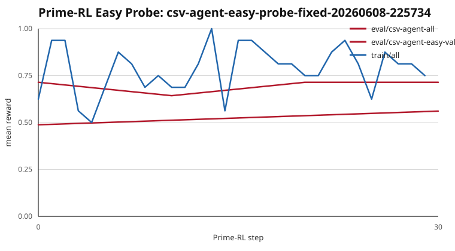

# Prime-RL Easy Probe: csv-agent-easy-probe-fixed-20260608-225734

- W&B: https://wandb.ai/thajpo/csv-agent/runs/fc3a61ef212949088e2912db2e51c238
- Hardware: PrimeBox `L40S_48GB x2`
- Model: `Qwen/Qwen3-4B-Instruct-2507`
- Dataset: `ThaJpo/csv-agent-template-episodes`
- Config: `configs/prime_rl/csv-agent-easy-hf.toml`
- Overrides: `trainer.model.optim_cpu_offload=true`
- Training: `30` steps, `batch_size=16`, `group_size=4`, `seq_len=2048`, easy train only
- Easy-val reward: step `0` = `0.7143`, step `10` = `0.6429`, step `20` = `0.7143`, step `30` = `0.7143`
- All-val reward: step `0` = `0.4878`, step `30` = `0.5610`
- Final all-val by difficulty: `EASY=0.7857`, `MEDIUM=0.4286`, `HARD=0.4000`, `VERY_HARD=0.6667`
- Caveats: easy-val has only `14` examples; zero-advantage filtering was `50%` in the final summary; hook-match metrics were `0.0`, so reward signal was effectively final-answer correctness in this run.
- Best mean reward: `1.0000` at step `13` (train/all)
- Points summarized: `36`
- Difficulty metrics: `metrics_by_difficulty.csv`

Generated from Prime-RL rollout JSONL files.
