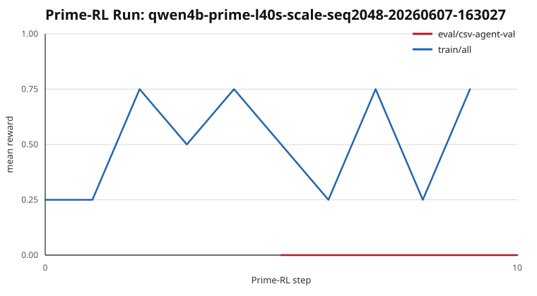

# Prime-RL Run: qwen4b-prime-l40s-scale-seq2048-20260607-163027

- W&B: https://wandb.ai/thajpo/csv-agent/runs/cf028ea6916a469c87c9e30da34d803d
- Hardware: PrimeBox `L40S_48GB x2`
- Model: `Qwen/Qwen3-4B-Instruct-2507`
- Dataset: `ThaJpo/csv-agent-template-episodes`
- Overrides: `max_steps=10`, `seq_len=2048`, `trainer.model.optim_cpu_offload=true`, `batch_size=4`, `group_size=2`, eval every 5 steps on 4 val examples
- Best mean reward: `0.7500` at step `2` (train/all)
- Final train mean reward: `0.7500`
- Val mean reward: `0.0000` at steps `5` and `10`
- Final summary caveat: eval truncation was `75%`; zero-advantage filtering hit `50%` of train rollouts in the final W&B summary.
- Points summarized: `12`

Generated from Prime-RL rollout JSONL files.
